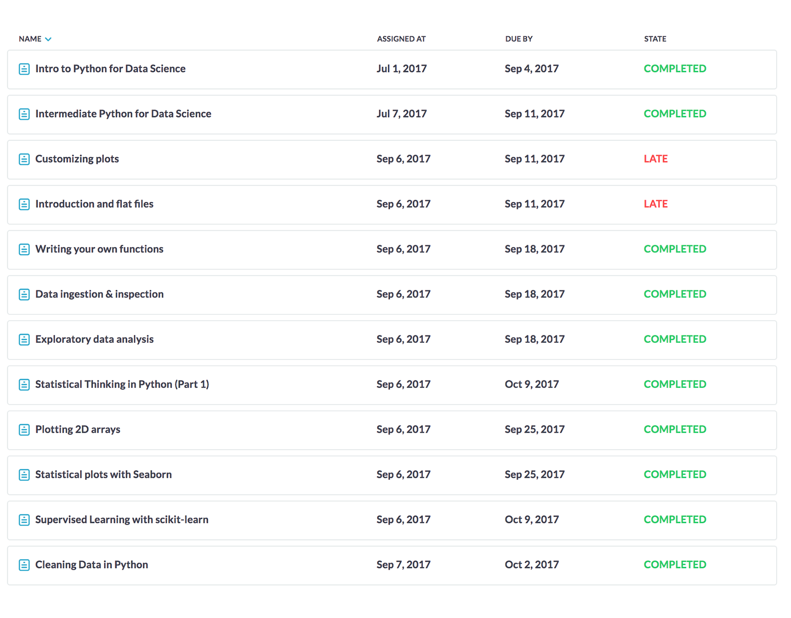

# Portfolio Applied Data Science
---

## Inhoud

1. [Urbinn](#urbinn)
2. [Producten](#producten) 
    1. [Scrum](#scrum) 
    2. [Issues](#issues) 
    3. [Overige](#overige) 
3. [Presentaties & Blog updates](#presentaties_blog)
4. [Cursussen en Workshops](#cursussen_en_workshops) 
    1.  [Coursera](#coursera) 
    2.  [Datacamp](#datacamp) 
    3. [Calling Bullshit](#calling_bullshit) 
    4. [Notebooks](#notebooks) 
    5. [Spark](#spark) 
5. [Belangrijke bijdrage](#Belangrijke_bijdrage)
# 1. Urbinn


URBINN is het LearningLab rondom autonoom rijdend vervoer binnen stedelijke gebieden (last mile). Binnen URBINN wordt een autonoom rijdend voertuig ontwikkeld dat als basis zal dienen om steeds verder te ontwikkelen en waar allerlei onderzoek op en mee gedaan zal gaan worden. URBINN is als LearningLab gelieerd aan het Lectoraat Smart Sensor Systems, terwijl de ontwikkeling van het voertuig geheel wordt gecoördineerd en gefaciliteerd binnen de Betafactory. Het onderzoek van URBINN sluit daarbij aan bij het onderzoeksplatform : “Goed Bestuur in een Veilige Wereld”.

In de portfolio geef ik  aan wat ik allemaal voor het project heb gedaan. Hier komen issues, opdrachten en courses aan bod.

---

# 2. Producten


## 2.1 Scrum 

De eerste week hadden we een scrum workshop waar we de principes van scrum konden leren. We moesten ook een opdracht ervoor maken. In deze opdracht heb ik beschreven hoe scrum aan de ‘Principles behind the Agile Manifesto’ voldoet. 
[Scrum opdracht](producten/scrum/Scrum.md)


## 2.2 Issues 

Hier worden de issues die ik gemaakt heb besproken.

Issue | Omschrijving 
------------ | -------------
[#1](https://github.com/urbinn/urbinn/issues/1) |  **Issue 1 :  Literatuur scan: gebruikte technologieen.**  <br> Voor deze issue heb ik bestaande technologieeen opgezocht die gebruikt worden bij zelfrijdende auto's. Ik heb naar bekende voorbeelden gezocht zoals Google Self Driving Cars en Tesla. <br> [Existing Technologies](files/Issue1/Issue_1.pdf) 
[#21](https://github.com/urbinn/urbinn/issues/21)  |  **Issue 21 :  Zoeken naar tutorials/videos voor LSD SLAM** <br> We hebben een paar bestaande technieken gevonden die gebruikt kunnen worden. Deze hebben we dan ondervedeelt en elke in meer detail onderzoeken. Op deze manier konden we een beslissing maken over welke methode het beste aansluit aan onze eisen. Ik heb SVO Semi-direct Visual Odometry.
[#27](https://github.com/urbinn/urbinn/issues/27)  |  **Issue 27 :  SVO Paper bestuderen**  <br> Ik heb samen met Isa een samenvatting van de werking van SVO (Semi-direct Visual Odometry) gemaakt   <br> [SVO Paper](files/Issue27/Issue_27.pdf) 
[#32](https://github.com/urbinn/urbinn/issues/32) |  **Issue 32 :  Camera Calibratie**  <br> Voor het kalibreren van de camera hebben we naar verschillende mogelijkheden gekeken. Een veelgebruikte standaard is de OpenCV Camera Calibratie framework. We hebben deze in de omgeving van ROS gebruikt.
[#40](https://github.com/urbinn/urbinn/issues/40) | **Issue 40 :  ORB2 save/load map** <br> De save/ load map feature is door een andere developer gemaakt . Het is gemaakt met behulp van de BOOST C++ framework. De boost serializatie zorgt ervoor dat de Map en de KeyframeDatabase classen geserializeerd worden.  Als de applicatie opnieuw geopend wordt kunnen de classen in dezelfde staat geïmporteerd worden. Op deze manier is het mogelijk een pointcloud te updaten met verschillende runs. Deze feature maakt een map.bin file met de classes.
[#41](https://github.com/urbinn/urbinn/issues/41)  | **Issue 41 :  ORB2 Incrementeel leren**   <br> Een onderdeel die niet in orb gemaakt was is de incrementeel leren. DIt betekend dat een pointcloud geipdatet kan worden door meer runs uit te voeren. 
[#42](https://github.com/urbinn/urbinn/issues/42) |  **Issue 42 :  Metrics voor evaluatie point cloud**  
[#44](https://github.com/urbinn/urbinn/issues/44) | **Issue 44 :  Installeren ORB2 SLAM server**  <br> Ik heb ORB SLAM2 samen met Jeffrey geïnstalleerd op een centrale server. (Eerste server)
[#47](https://github.com/urbinn/urbinn/issues/47) | Issue 47 :  Beschrijven data structuur in text file 
[#51](https://github.com/urbinn/urbinn/issues/51) | **Issue 51 :  ORB2 extracten points naar csv file**  <br> Om de evaluatie uit te voeren hebben we de gegenereerde point cloud nodig om de nauwkeurigheid van de algoritme te bepalen. De functionaliteit was toegevoegd en gemerged met de master branch.
[#55](https://github.com/urbinn/urbinn/issues/55) | **Issue 55 :  Object detection papers lezen** <br> Voor het selecteren van een object detection framework moesten we twee papers doornemen.We zijn tijdens de  group reading sessions snel achter gekomen dat YOLO (You Only Look Once) het beste was.
[#56](https://github.com/urbinn/urbinn/issues/56) | **Issue 56 :  Presentatie maken + blog updaten**
[#58](https://github.com/urbinn/urbinn/issues/58) | **Issue 58 :  Beschrijven data structuur MapPoint in ORB2** <br> ORB SLAM2 is een open source SLAM algoritme met een loop closure mogelijkheid. Dit is een van de belangrijke redenen waarom we ervoor hebben gekozen. De source code was volledig gedocumenteerd.  Ik heb documentatie toegevoegd aan de source code. Dit is voor de map point structuur gedaan. 
[#60](https://github.com/urbinn/urbinn/issues/60) |  **Beschrijven structuur KeyFrameDatabase in ORB2**
[#72](https://github.com/urbinn/urbinn/issues/72) | **Issue 72 :  Resutaten ORB2 bin exporteren** <br> ORB SLAM2 is in c++ geschreven. Om het import tool te maken moest ik een functie maken in c++ die van ORB SLAM 2 geïmporteerd kon worden in een andere programma.
[#79](https://github.com/urbinn/urbinn/issues/79) | **Issue 79 :  ORB coordinaten converteren** 
[#80](https://github.com/urbinn/urbinn/issues/79) | **Issue 80 :  ORB output uitbreiden met keyframe coordinaten** <br> De coordinaten van keyframes waren nodig bij de output. De coordinaten moesten opbieuw geimporteerd worden.
[#81](https://github.com/urbinn/urbinn/issues/81) | **Issue 81 :  Literatuur scan: filteren slam met object detectie** <br> We moesten onderzoeken of er een techniek bestond of SLAM gemaakte punten te filteren met een object detection framework. 
[#86](https://github.com/urbinn/urbinn/issues/86) |  **Issue 86 :  Ground truth nieuwe trainingsdata labelen**
[#89](https://github.com/urbinn/urbinn/issues/89) | **Issue 89 :  import xml data (pointcloud) orbslam2** De data die  in de xml format was opgeslagen moest opnieuw geimporteerd worden. Ik heb een methode daarvoor gemaakt. Zo is het mogelijk om gexporteerde data in xml format opnieuw te importeren. 
[#91](https://github.com/urbinn/urbinn/issues/91) | **Issue 91 :  ORB2 pointcloud maken slinger** <br> Ik heb een pointcloud gemaakt van onze gemaakte opnames van de slinger. 
[#106](https://github.com/urbinn/urbinn/issues/106) | **Issue 106 :  Orb2 stability fix** <br> Ik heb een paar memory leaks in orb slam 2 gevonden. Ik heb deze dan gefixt.
[#112](https://github.com/urbinn/urbinn/issues/112) | **Issue 112 :  URB: Evaluatie Pointcloud** 
[#126](https://github.com/urbinn/urbinn/issues/126) |  **Issue 126 :  Local Bundle Adjustment** <br> Ik heb de local bundle adjustment voor urb gemaakt. De input data moest geconverteerd worden zodt g2o de data kon gebruiken. Ik heb hiervoor ook een script gemaakt om de timestamps van de alfbeeldingen te genereren. [Script](files/scripts/timestamp.md) 
[#132](https://github.com/urbinn/urbinn/issues/132) | **Issue 132 :  Efficient depth estimation**  <br> Voor deze issue moest er een effieciente manier bedacht worden om de patches heen te loopen. We zijn niet tot de implementatie van deze feature gekomen. Het is een issue die voor de real time semmentic mapping van belang is.
[#134](https://github.com/urbinn/urbinn/issues/134) | **Issue 134 :  Een centrale repository maken van Pyurb en g2o**  <br> Er waren verschillende repositories waar leden van de groep in werkten. Jeroen en ik hebben samen een centrale repositry opgezet waar iedereen kan werken. Dit zorgt voor overzicht van alle code.
[#136](https://github.com/urbinn/urbinn/issues/136) |  **Issue 136 :  Full BA code schrijven**  <br> De code de full bundle adjustment 
[#137](https://github.com/urbinn/urbinn/issues/137) |  **Issue 137 :  Handmatig bepalen welke frame overlappen op Sequence 07 KITTI** <br> Om de Full bundle adjustment uit te testen hebben we handmatig bepaald welke frames op de zelfde locatie zijn. 
[#145](https://github.com/urbinn/urbinn/issues/145) | **Issue 145 :  Urb BA code testen en debuggen** <br> We kregen geen goeie output van BA. Hierdoor was ik bezig om de code BA te controleren. We hebben ook testen ervoor gemaakt. 


# 3 Presentaties & Blog updates  

Er is een planning gemaakt waar iedereen een paar weken de blog moet updaten en presentaties moet geven. 

In de folder staat elke presentatie die ik gemaakt heb. [Presentatie's folder](producten/presentaties) 

| Week | Presentatie |
|------|:-----------:|                  
|Week 5|[Presentatie](producten/presentaties/Week_5_presentatie.pptx)|
|Week 6|[Presentatie](producten/presentaties/Week_6_presentatie.pptx)|
|Week 13|[Presentatie](producten/presentaties/Week_13_presentatie.pptx)|
|Week 14|[Presentatie](producten/presentaties/Week_14_presentatie.pptx)|
|Week 17|[Presentatie](producten/presentaties/Week_17_presentatie.pptx)|


# 4. Cursussen en Workshops

## 4.1 Coursera 

Ik heb de Machine Learning course van Coursera gevolgd. Deze cursus heeft geholpen om gebruikte technieken van data science te begrijpen en  toe te passen tijdens de minor.


## 4.2 Datacamp 

Ik heb de datcamp assigments gedaan. Het heeft geholpen om met veel gebruikte data science frameworks in python te leren programmeren.





## 4.3 Calling Bullshit 

Ik heb de "Calling bullshit in the age of big data" opdracht gemaakt. Hier moest ik onjuist informatie vinden die "bullshit" is.
[Calling Bullshit](producten/calling_bullshit/CallingBullshit.pdf)

## 4.4 Notebooks 

Ik heb een paar python opdrachten in notebooks gemaakt. De notobooks  kunnen hier gevonden worden. [Notebooks folder](producten/notebooks)

## 4.4 Spark 

Ik heb een paar Spark opdrachten gedaan. De spark files kunnen hier gevonden worden. [Spark folder](producten/spark)


# 5. Belangrijke bijdrage


**Save load Orb Slam 2**

Het opnieuw inladen van een pointcloud model met zijn trajectory om die verder te leren. Boost serialization is hiervoor gebruikt. Daarna zijn we overgestapt naar XML loading.

Serialization met onnodige data .
```javascript
    string localString = filename;
    localString.append(".bin");
    std::ifstream is(localString, std::ios_base::binary);
    if (!is) {
        cerr << "Cannot Open Mapfile: " << mapfile << ", Create a new one" << std::endl;
        return false;
    }
    boost::archive::binary_iarchive ia(is, boost::archive::no_header);

    ia >> mpMap;
```

Keuze van belangrijke data die opgeslagen moet worden.
```javascript
    string localStringTXT = filename;
    localStringTXT.append("XML.txt");

    if (!fileExists(localStringTXT)) {
        return false;
    }

    using boost::property_tree::ptree;
    ptree pt;
    read_xml(localStringTXT, pt);
    
    std::vector<KeyFrame*> keyframes = KeyFrame::keyFrameFromPropertyTree(pt);
```


Full Bundle Adjustment, Motion Only Bundle Adjusmtment, Outliers Detection en Local Bundle Adjumstment.

Ik heb aan de g2o methodes gewerkt om ervoor te zorgen dat de input die van urb komt doot g2o gebruikt kon worden. 

```javascript
    std::vector<KeyFrame> vpKFs;

    for(int n = 0; n < keyframes.rows(); n++) {
        Eigen::MatrixXd currentFrame(4, 4);
        currentFrame << keyFrameRowToMatrix(keyframes.row(n));
        // cout << currentFrame << std::endl;
        // cout << keyframes.row(n)(0) << endl;
        KeyFrame frame = std::make_pair( std::make_pair(n,keyframes.row(n)(0)) , currentFrame);
        vpKFs.push_back(frame);
    }
```

Bij het filteren van observation die onjuist zijn heb ik ook aan geholpen. Hier worden observation uitgefiltered die niet goed te matchen zijn. 

```javascript
    self._observations = [ o for o in self._observations if o.get_patch().flatten().std() > 20 ]
```
